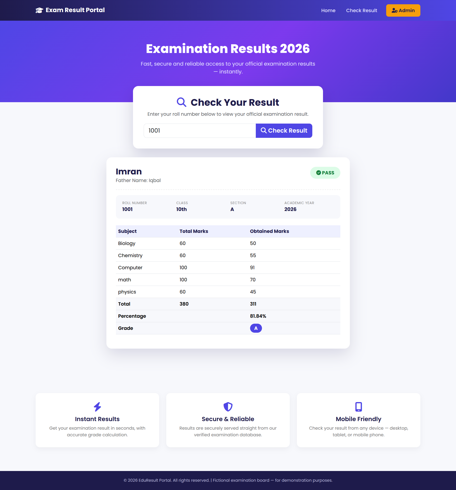
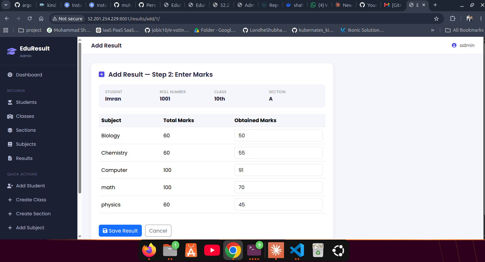
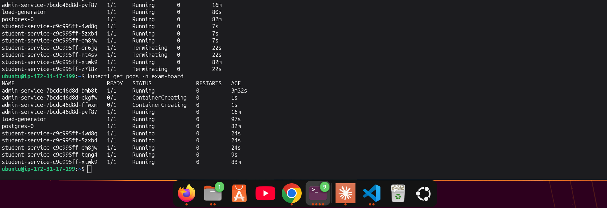
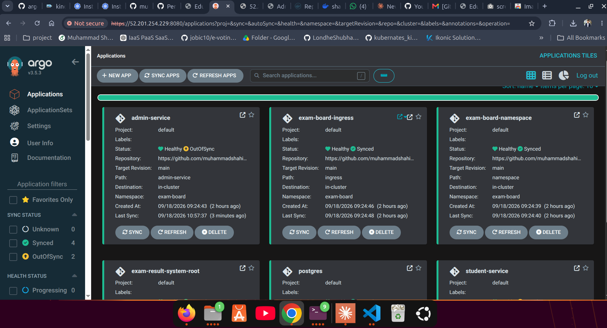
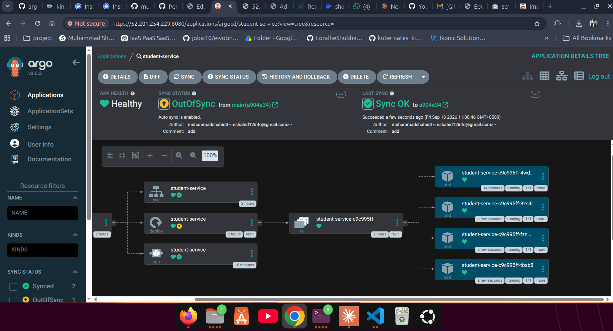

# Exam Result System — Project Documentation

## Table of Contents
1. [Project Overview](#1-project-overview)
2. [Docker & Microservices](#2-docker--microservices)
3. [ArgoCD](#3-argocd)
4. [Helm Charts](#4-helm-charts)
5. [CI/CD Pipeline](#5-cicd-pipeline)
6. [Image Updater (Auto Image Sync)](#6-image-updater-auto-image-sync)
7. [Autoscaling (HPA)](#7-autoscaling-hpa)
8. [Ingress](#8-ingress)
9. [Overall Flow Summary](#9-overall-flow-summary)

---







## ArgoCD Installation Commands (Quick Reference)

The commands below were used to install ArgoCD on the cluster, verify the installation, and gain access to it. The purpose of each command is explained underneath it.

```bash
# 1. Install ArgoCD into the "argocd" namespace
kubectl apply -n argocd -f https://raw.githubusercontent.com/argoproj/argo-cd/stable/manifests/install.yaml
```
**Purpose:** Applies all of ArgoCD's official Kubernetes manifests (Deployments, Services, CRDs, RBAC, etc.) into the `argocd` namespace. This creates the ArgoCD server, repo-server, application-controller, and the rest of the core components in the cluster.

```bash
# 2. Check the status of the pods
kubectl get pods -n argocd
```
**Purpose:** Confirms that all ArgoCD pods (server, repo-server, application-controller, redis, dex, etc.) have reached the `Running` state successfully, i.e. that the installation did not fail.

```bash
# 3. Check the status of the services
kubectl get svc -n argocd
```
**Purpose:** Shows the type and port of ArgoCD's services (particularly `argocd-server`), which indicates how the UI/API can be accessed (ClusterIP, NodePort, or LoadBalancer).

```bash
# 4. Retrieve the initial admin password
kubectl get secret argocd-initial-admin-secret -n argocd \
  -o jsonpath="{.data.password}" | base64 -d && echo
```
**Purpose:** After installation, ArgoCD auto-generates an admin password and stores it in a Kubernetes Secret. This command base64-decodes that secret and prints it in plain text so it can be used for the first login.

```bash
# 5. Download the ArgoCD CLI
curl -sSL -o argocd-linux-amd64 https://github.com/argoproj/argo-cd/releases/latest/download/argocd-linux-amd64
```
**Purpose:** Downloads ArgoCD's official command-line tool (CLI binary), which allows ArgoCD to be managed (login, app sync, app status, etc.) directly from the terminal, without using the Web UI.

```bash
# 6. Install the CLI system-wide
sudo install -m 555 argocd-linux-amd64 /usr/local/bin/argocd
```
**Purpose:** Copies the downloaded binary into `/usr/local/bin/` with executable permissions (`555`), so the `argocd` command becomes available from anywhere in the terminal.

```bash
# 7. Remove the temporary downloaded file
rm argocd-linux-amd64
```
**Purpose:** Once installed, the raw binary file is no longer needed, so it is deleted as a cleanup step.

```bash
# 8. Log in via the ArgoCD CLI
argocd login <instance_public_ip>:8080 --username admin --password <initial_password> --insecure
```
**Purpose:** Authenticates the CLI against the ArgoCD server (using the `admin` username and the password retrieved in step 4), enabling ArgoCD applications to be managed from the terminal. The `--insecure` flag is used because the server does not yet have a valid TLS certificate at this stage.

---

### Screenshots

> The items below are placeholders — replace them with the links/paths to your actual screenshots (for example, by creating an `images/` folder in your GitHub repository, uploading the screenshots there, and updating the links accordingly).


*Screenshot 1: Output of `kubectl get pods -n argocd` — all ArgoCD pods in the "Running" state.*


*Screenshot 2: Successful ArgoCD CLI login, or the ArgoCD Web UI dashboard.*


*Screenshot 2: Successful ArgoCD CLI login, or the ArgoCD Web UI pod dashboard.*

---

## 1. Project Overview

The Exam Result System is a microservice-based application composed of two separate Django services and a shared database:

- **Admin Service** — the admin panel, used to manage classes, sections, subjects, students, and results.
- **Student Service** — the student-facing portal, where students can view their results.
- **Database** — both services share data stored in a single PostgreSQL database.
- **Ingress** — routes incoming external traffic to the correct service based on the `/admin` and `/student` paths.

---

## 2. Docker & Microservices

The entire project is built on a **microservices architecture** — meaning the admin panel and the student portal are two completely separate applications, each with its own codebase and its own deployment lifecycle, while sharing a single database.

The containerization process was as follows:

1. **Each microservice has its own Dockerfile** — the Admin Service and Student Service were containerized independently, so each could be built, deployed, and scaled separately.
2. **A lightweight/slim Python base image** was used to keep the image size small and startup time fast.
3. **Dependencies** (`requirements.txt`) are installed first, and application code is copied afterward — this improves Docker layer caching (if only the code changes, dependencies don't need to be reinstalled).
4. **An entrypoint script** was included with each service that, on container startup:
   - Waits for the database to become ready
   - Applies database migrations
   - Collects static files
   - Runs the service (Admin Service on port 8001, Student Service on port 8000)
5. **A `docker-compose` file** was created for local testing, running the database and both services together — to confirm everything works correctly before moving to Kubernetes.
6. **Images were built and pushed to Docker Hub**, so the Kubernetes cluster could pull them from there.

This approach made it straightforward, later on, to give each service its own independent Helm chart and its own CI/CD pipeline — because both services were designed as independent components from the very start.

---

## 3. ArgoCD

Instead of deploying manually (`kubectl apply` / `helm install`), **ArgoCD** was used — a GitOps tool that treats the Git repository as the "source of truth" and automatically brings the Kubernetes cluster into that state.

The process was as follows:

1. **ArgoCD was installed into the cluster** in its own dedicated namespace, to keep it separate from application workloads.
2. **An "Application" definition was created for each component** — namespace, database, admin service, student service, and ingress each have their own Application entry.
3. **A "root" Application (App-of-Apps pattern) was created** — this single Application only needs to be applied once; it automatically discovers and creates all the other Applications by reading the Git repository. This minimized manual steps.
4. **An automated sync policy was configured** — meaning whenever a change is pushed to the Git repository, ArgoCD automatically detects it and updates the cluster, with no manual commands required.
5. **Sync ordering (waves) was configured** — so the namespace is created first, then the database, then the services, and finally the ingress. This avoids dependency-related errors (such as a service starting before the database is ready).
6. **Self-healing was also enabled** — if someone manually changes something in the cluster that doesn't match Git, ArgoCD automatically reverts it back to the correct state defined in Git.

The result is a fully automated deployment process — push code, and ArgoCD handles the rest of the sync automatically.

---

## 4. Helm Charts

Instead of keeping deployment manifests as plain Kubernetes YAML, they were converted into **Helm charts**. It was also decided that, rather than building one large "umbrella" chart, **each component would have its own independent chart**:

- **Namespace chart** — creates only the application's namespace.
- **Database (Postgres) chart** — contains the database credentials (Secret), storage (Persistent Volume), and the database server (StatefulSet + Service).
- **Admin Service chart** — contains the admin panel's Deployment, Service, and autoscaling configuration.
- **Student Service chart** — contains the student portal's Deployment, Service, and autoscaling configuration.
- **Ingress chart** — contains the routing rules that direct incoming external traffic to the correct service.

Each chart has its own `values` file, where the image name/tag, port, resource limits, replica count, environment variables, database credentials, and so on can be configured without touching the templates.

**Benefits of giving each component its own chart:**
- Each service can be updated/deployed independently — deploying a new version of the admin service doesn't require touching the student service.
- Each chart gets its own Application in ArgoCD — status, health, and sync history are tracked separately.
- Adding new services in the future is easy — just create a new chart and its corresponding Application entry.

Key settings kept in the database chart:
- Credentials are stored in a secure Secret (not as plaintext values).
- Data is stored on a Persistent Volume, so it isn't lost if the pod restarts.
- Readiness/liveness health checks are configured, so Kubernetes knows when the database is ready.

---

## 5. CI/CD Pipeline

An automated pipeline (via GitHub Actions) was set up in each microservice's code repository:

1. Whenever a change is pushed to the Admin Service or Student Service code, its pipeline is triggered automatically.
2. The pipeline builds a new Docker image.
3. The new image is pushed to Docker Hub with a fixed tag.
4. The two services' pipelines are independent — only the pipeline for the service whose code changed runs.

---

## 6. Image Updater (Auto Image Sync)

Pushing a new image to Docker Hub is not enough on its own — the cluster also needs to know that a new version is available. For this, **ArgoCD Image Updater** was used:

1. This tool periodically checks the registry for a new image version.
2. As soon as a new version is found, it notifies ArgoCD to use the new image.
3. **Git write-back was also enabled** — meaning when the image is updated, Image Updater automatically commits the new image tag to the Git repository. This ensures Git always reflects the current state (a core GitOps principle).

This means the entire flow is fully automated: push new code → a new image is built and pushed → Image Updater detects it → Git is updated → ArgoCD deploys it — with no manual intervention required.

---

## 7. Autoscaling (HPA)

A **Horizontal Pod Autoscaler** was configured for both services (Admin and Student):

- Minimum and maximum replica counts were defined for each service.
- A target CPU usage percentage was set — if CPU load rises above it, replicas scale up automatically; when load decreases, replicas scale back down automatically.
- A metrics-collecting component (metrics-server) was deployed in the cluster to track CPU/memory usage, which is required for HPA decisions.

This allows the service to scale automatically during traffic spikes, while avoiding wasted resources under normal load.

---

## 8. Ingress

An Ingress was configured to route incoming external traffic to the correct service:

- Traffic on the `/admin` path is routed to the Admin Service.
- Traffic on the `/student` path is routed to the Student Service.
- The entire application is accessible through a single entry point (the ingress controller), without needing to expose separate ports.

---

## 9. Overall Flow Summary

1. A developer writes and pushes code (into either the Admin or Student service folder).
2. The CI/CD pipeline automatically builds a new image and pushes it to Docker Hub.
3. Image Updater detects the new version and commits it to the Git repository automatically.
4. ArgoCD detects the change in Git and automatically updates the cluster — no manual commands are needed.
5. HPA automatically adjusts replicas based on traffic.
6. Ingress routes user requests to the correct service.

The entire system is designed so that, from a code push all the way to going live in production, everything is fully automated.